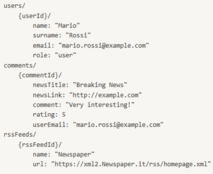
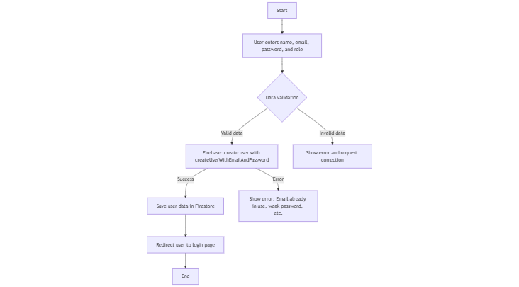
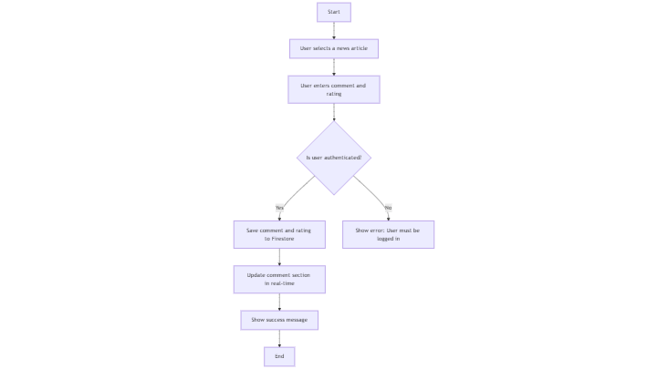
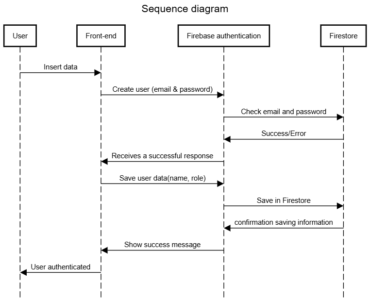
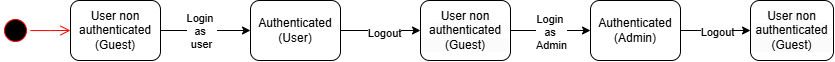
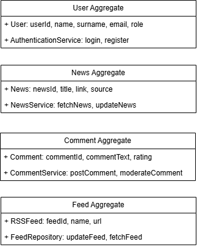

# Architecture

The NewsNowBot system follows a **client-server architecture** based on **Firebase**, which serves as both the back-end and the authentication and data management system.

## Front-End

**HTML, CSS, and JavaScript:**

Our NewsNowBOT app's front-end uses three main web technologies:

- **HTML** creates the page structure,

- **CSS** makes it look good and work on all screens,

- **JavaScript** makes it interactive. When users click buttons or fill forms, JavaScript updates both what they see and what gets saved to the server. You can see exactly how this works in the flowchart diagram.

 ## Back-End

**Firebase:**

Given its scalability and ease of integration, **Firebase** has been chosen as the back-end solution to handle user authentication and data management efficiently.

-   **Authentication:** Firebase Authentication is used to manage user login and registration securely. It allows users to sign up with email and password while ensuring proper session handling through Firebase's built-in authentication mechanisms.
-   **Database:** Cloud Firestore is utilized to store user profiles, comments, and other application data in a structured and scalable manner. The Firestore database ensures real-time synchronization and optimized queries for retrieving and updating data.
-   **Security & Permissions:** Data access and user roles are managed using Firestore security rules, ensuring that only authorized users can access or modify specific information.

The sequence diagram illustrates the interaction between the user, the front-end browser logic, and Firebase during user authentication and data retrieval, highlighting the seamless integration between the different components.

## Chosen Architecture

The adopted architecture is **serverless**, where the front-end communicates directly with Firebase for authentication and data access. This choice ensures:

-   **Automatic scalability:** Firebase automatically manages the workload, adapting to application needs without requiring manual server provisioning.
-   **Reduced server-side maintenance:** Without the need for a traditional back-end, costs and complexity associated with server management, updates, and security are eliminated.
-   **Advanced security through Firestore access rules:** Firebase Security Rules allow precise definition of who can read and write data in the database, restricting access based on user authentication and permissions.
-   **Native front-end integration:** Using the Firebase SDK enables managing database interaction and authentication directly from the client, reducing latency and improving application responsiveness.
-   **Real-time synchronization:** Cloud Firestore provides automatic updates and instant synchronization between connected users, enhancing the user experience in news commenting and rating features.

## Domain Modeling

The domain is modeled around three main entities:

- User

- News

- Comment

### Class Structure

The main system entities are:

- **User**: contains information such as name, surname, email and role.

- **Comment:** linked to a News, includes commentText, rating and userEmail.

- **RSS Feed:** stores news sources, with name, url.

Example of Firestore structure:

## Interaction

**Component Interaction**

The interaction between the front-end and Firebase occurs through asynchronous calls for:

-   User registration and authentication (auth.js)
-   Saving and retrieving comments (comments.js)
-   Loading and updating RSS feeds

**Interaction Flow**

**User Registration**

1.  The user enters their name, email, and password in the registration form.
2.  The client calls registerUser() in auth.js, which uses Firebase's createUserWithEmailAndPassword().
3.  Once the account is created, the data is saved in Firestore.
4.  The system returns the operation's success and authenticates the user.

Figure 2. Flowchart of user registration

**Comment Publication**

1.  The authenticated user selects a news article and writes a comment.
2.  The client calls submitComment() in comments.js, which uses addDoc() to save the comment in Firestore.
3.  The database updates the data and synchronizes new comments in real-time for all users.

Figure 3. Publication comment flowchart

**RSS Feed Loading**

1. The system retrieves RSS sources stored in Firestore.

2. Through periodic requests, the client updates the news list.

3. Users view the most recent news in real-time.
   

Figure 4. Sequence diagram

## Behavior

**System States**

The system can be in the following main states:

- **Unauthenticated User** → Can only view news.

- **Authenticated User** → Can comment on and rate news.

- **Administrator** → Can manage users and moderate comments.

State transitions:

- User registers or logs in → Moves from "unauthenticated" to "authenticated".

- User logs out → Returns to "unauthenticated" state.

- Administrator logs in → Gains additional permissions.

Figure 5.State diagram

### Data-related aspects

**Data Schema**

The database is organized in Firestore with a collection and document structure:

- **Users** (contains user data)

- **Comments** (contains comments associated with news)

- **News** (potential collection for managing news directly in Firestore)

**Data Persistence**

Firestore manages data persistence in the cloud, with:

- **Real-time synchronization** between client and database

- **Security rules** to limit data access to authorized users only

**Technologies Used**

- **Firebase Authentication** for secure user management

- **Cloud Firestore** for scalable and flexible data storage and retrieval

## Domain Driven Design

In the Project we have defined two main Bounded Contect:

- **Authentication Context** (User Authentication): Manages user registration, authentication and management.

- **News and Feed** (News and Feed): Manages the management of news and comments, along with updating RSS feeds.

The main entities in **NewsNowBot** are:

-   **User**: Represents a system user.

-   Attributes: *userId, name, surname, email, role*.

-   **News**: Represents a news article retrieved from RSS feeds.

-   Attributes: *newsId, title, link, source*.

-   **Comment**: Represents a user comment on a news article.

-   Attributes: *commentId, userId, newsId, commentText, rating, timestamp.*

-   **RSSFeed**: Represents an RSS news source.

-   Attributes: *feedId, name, url*.

In **NewsNowBot**, we define the following aggregates:

-   **User Aggregate**: Contains the User entity and authentication logic.
-   **News Aggregate**: Contains the News entity, news retrieval logic, and associated comments.
-   **Feed Aggregate**: Contains the RSSFeed entity, managing feed synchronization and updates.

Domain services contain business logic that doesn't naturally fit into a single entity or aggregate but is essential for the domain. Examples of services in **NewsNowBot**:

-   **AuthenticationService**: Handles user registration, login, and session management.
-   **NewsService**: Fetches and updates news articles from RSS feeds.
-   **CommentService**: Manages comment posting, moderation, and retrieval.

Repositories handle data persistence and retrieval. In DDD, a repository is used to manage aggregates or entities from the database. **NewsNowBot** includes:

-   **UserRepository**: Manages user data access and persistence.
-   **NewsRepository**: Handles news articles storage and retrieval.
-   **FeedRepository**: Manages RSS feed sources and updates.

Domain events represent significant changes within the system, used for communication between different components. Examples of domain events in **NewsNowBot**:

-   **UserRegistered**: Triggered when a user successfully registers.
-   **UserAuthenticated**: Triggered when a user logs in successfully.
-   **NewsFetched**: Triggered when a news article is retrieved from an RSS feed.
-   **CommentPosted**: Triggered when a comment is submitted on a news article.
-   **FeedUpdated**: Triggered when an RSS feed is updated.

Figure 6.DDD diagram
