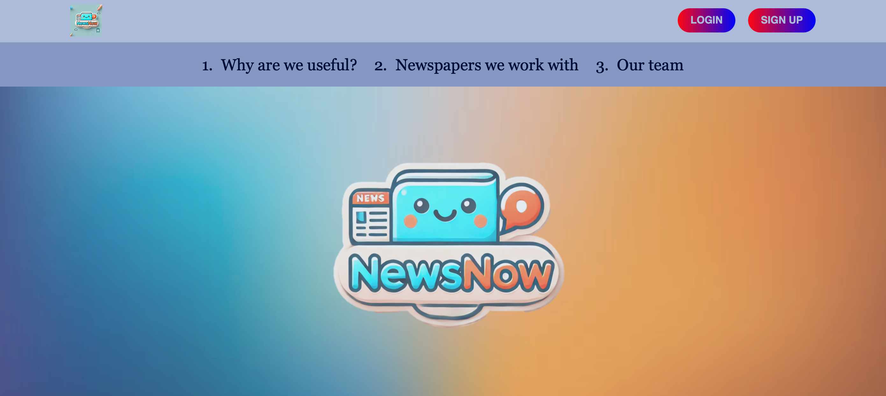
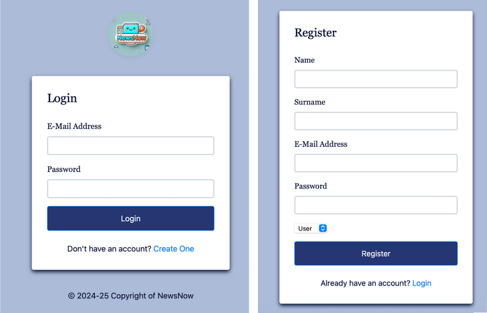
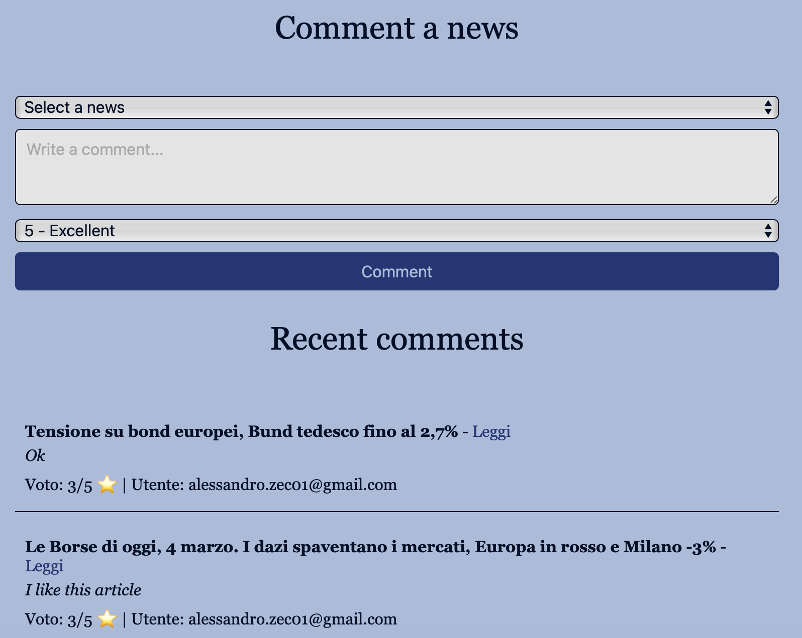
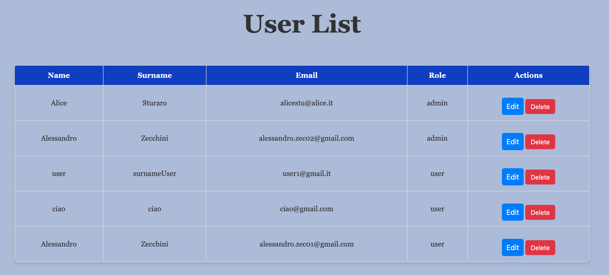
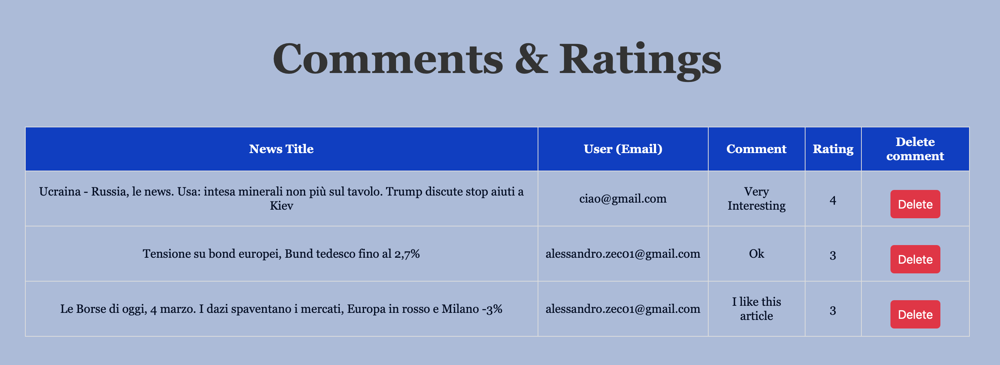
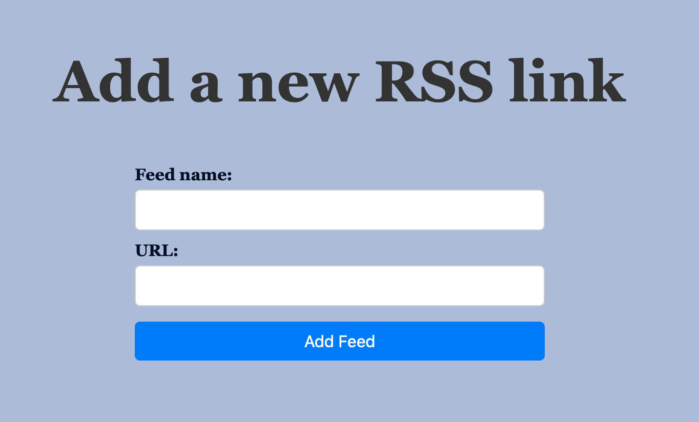
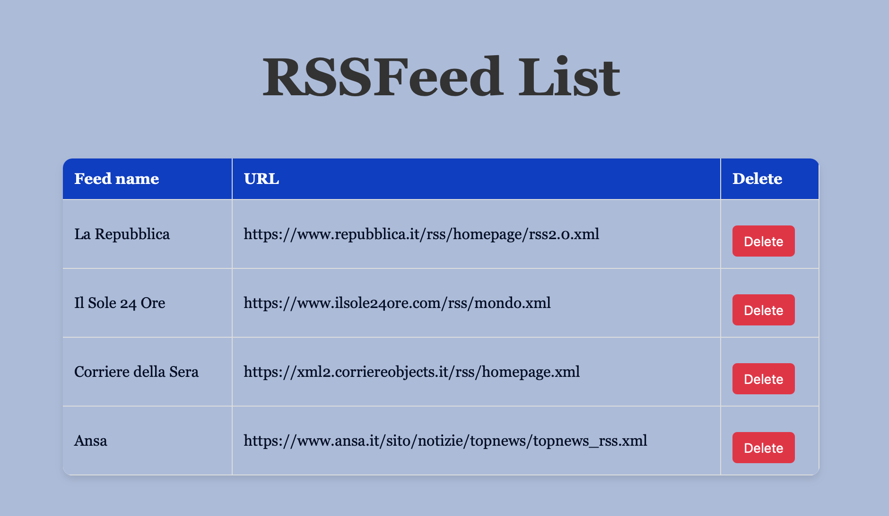

# User Guide

When a person click on our website, they will be directed to our homepage
 
## Homepage
 
The homepage contains a photo with the logo of Newsnow and 3 sections:
 
1. Why are we uselful? -> We explain what our platforms provide to people who use it
 
2. Newspapers we work with ->  People can see the newspapers from which we get the news  
 
3. Our Team -> People can see who we are, our photos and roles
 
In order to properly use the platform, people have to login or sign up
 
Buttons to do so are in the upper-right corner

 
 
## Sign up page
 
If a person doesn't have an account yet, he/she has to click on sign up and register
 
They have to write their name, surname, email (which will be their ID) and choose a password.
 
Finally they must select whether they want to create an account as a user or an admin.
 
In fact, people who use NewsNow can be divided into Users and Admins.
 
## Login page
 
If a person already has an account, he/she has to click on the login button and write their email and password

 
## User page
 
On the user page they'll find a search bar and two sections
 
1. The Search bar is currently not working but the idea is that users can enter a keyword to find news containing it (this feature is not currently available but may be developed in future versions).
 
2. In the "Breaking News" section, users can read the latest news from 4 different sources.
 
If they click on the news article, they will be directed to the proper website where they can read the full article
 
3. In the "Comments and ratings" section, users can select a news article, write a comment and give a rating from 1 (terrible) to 5 (excellent).
 
They can also see the comments and ratings left by other users on a specific news article.

 
 
If users want to log out, they can simply click the **Logout** button in the upper-right corner.
 
## Admin page
 
The Admin page contains 4 sections:
 
1. On the "User List" section, admins can view all the people registered in the website (email, name, surname), their role (admin or user) and they can take actions by editing or deleting user profiles

 
2. In the **"Comments and Ratings"** section, admins can view comments left on specific news articles, along with their ratings and the users who posted them.
 
Admins also have the ability to delete comments, for example if they are offensive or considered spam.

 
3. In the third section, **"Add a New RSS Link",** admins can add new RSS links

 
4. Finally in the "RSSFeed List" section, admins can see the list of newspapers from which we take the news articles, their URL and have the possibility to delete them

