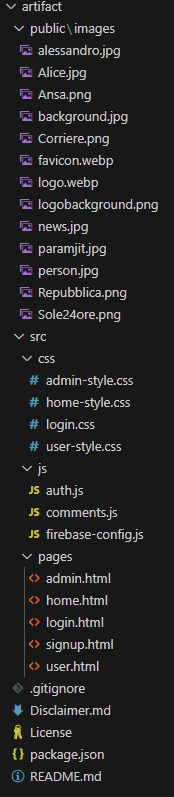
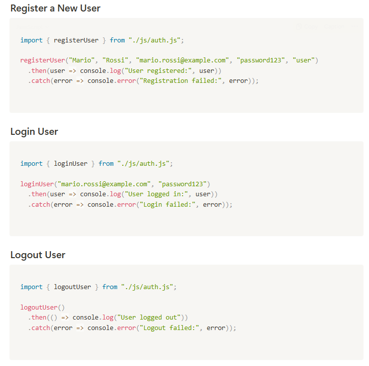
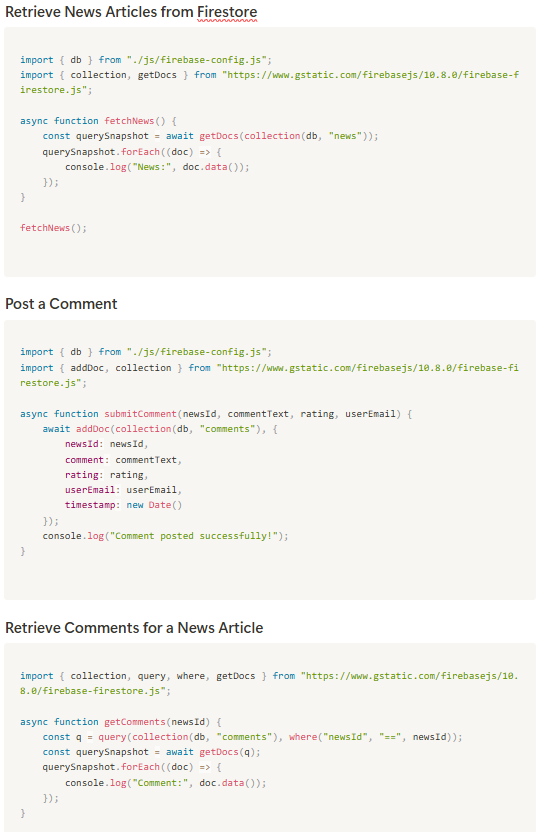
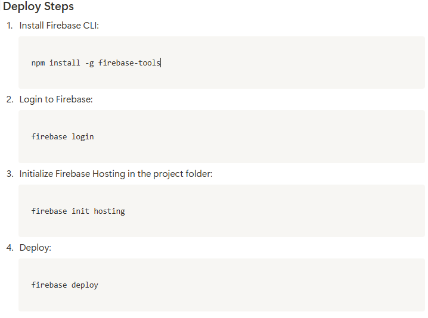

# Developer Guide

**NewsNowBot** is built using **Firebase Authentication**, **Firestore Database**, and **JavaScript** for front-end and back-end interactions. The system allows developers to:

-   Manage user authentication (registration, login, logout).
-   Retrieve, update, and manage news articles from RSS feeds.
-   Post, retrieve, and moderate comments.
-   Extend functionality through API calls to Firebase.

**Prerequisites**

To start working with **NewsNowBot**, you need:

-   **Node.js** installed (optional but recommended for development).
-   **Visual Studio Code** or any code editor.
-   A **Firebase project** set up with Firestore and Authentication enabled.
-   A web server for local testing (e.g., Live Server for VS Code).

**Project Structure**

**Authentication API**

Developers can integrate Firebase Authentication for managing user access. The auth.js module provides functions for user authentication:

**Firestore Database API**

Firestore is used to store and retrieve news, comments, and users. Developers can interact with Firestore using Firebase SDK functions.

**Deploying the Application**

To deploy **NewsNowBot**, you can use Firebase Hosting:

